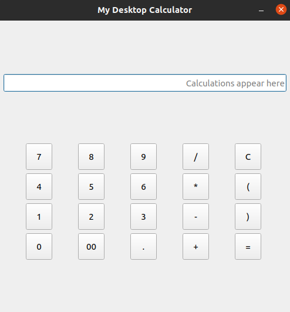

# Simple PyQt Desktop Calculator
This is a simple PyQt5 desktop calculator application that works like the usual operating system desktop-based calculators

## Technologies
1. Git 2.25.1 - Tool used for version control.
2. Python 3.8.10 - Main language used to write the application logic.
3. PyQt5 5.15.4 - Desktop user interface library based on C++ Qt framework.

## Installation
1. Download and install Git using the instructions highlighted [here](https://git-scm.com/book/en/v2/Getting-Started-Installing-Git).
2. Download and install Python using the instructions highlighted [here](https://docs.python-guide.org/starting/installation/). When installing
on Windows OS ensure that [pip](https://pip.pypa.io/en/stable/) is installed.
   
3. Open the terminal (Linux) or command prompt (Windows) and clone this repository by typing: 
`git clone https://github.com/jkariukidev/desktop_calculator.git`
   
4. Navigate to the cloned repository or folder and identify the file [__requirements.txt__](./requirements.txt) that contains
the libraries used in this application.
   
5. Run the following command to install the dependencies. 
`pip install -r requirements.txt`
   
6. After installation of libraries has been completed you can run the file [__calculator.py__](./calculator.py) using the command: 
`python calculator.py` to run the calculator application.
   
7. The calculator user interface should appear as shown below.
     

   
### Examples of use
This desktop application can be used as a calculator to perform basic
calculations such as addition, subtraction, multiplication and division and 
angle calculations. Below is an illustration of the working of the calculator.

https://user-images.githubusercontent.com/23359514/161768731-4a21e858-cb1a-4335-87af-69e9b3794ad1.mp4

### Sources
1. Riverbank Computing - [PyQt Documentation](https://www.riverbankcomputing.com/software/pyqt/)
2. GeeksforGeeks - [Building a calcualtor using PyQt5 in Python](https://www.geeksforgeeks.org/building-calculator-using-pyqt5-in-python/)
3. UDemy - [PyQt5 Tutorial - Create a Calculator!! ](https://www.udemy.com/course/create-a-calculator-in-pyqt5/)
